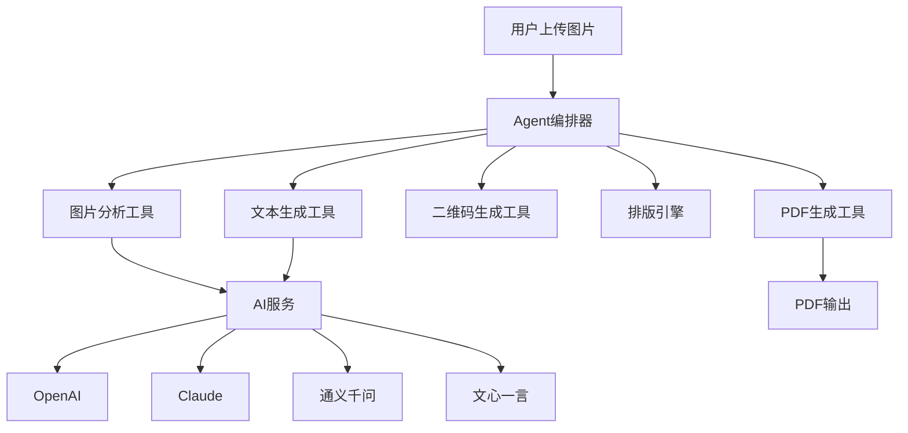
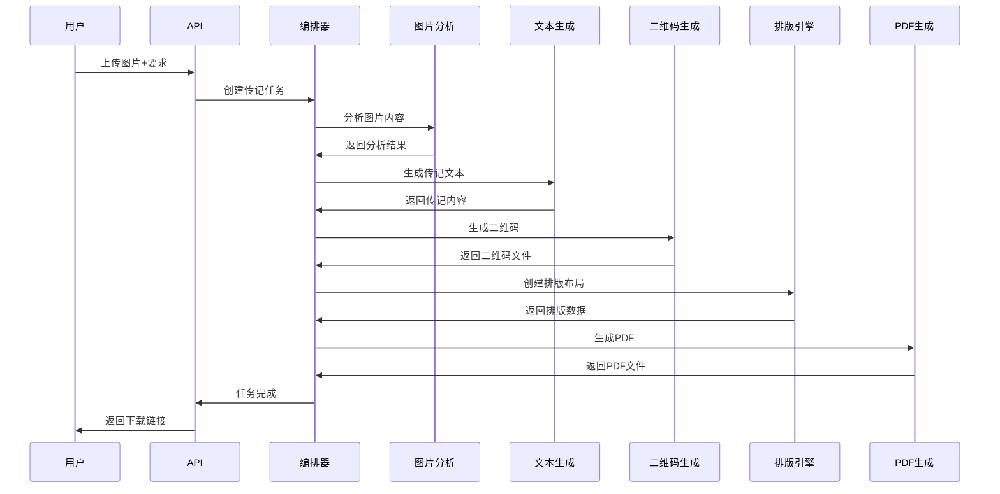

# 个人传记撰写Agent架构总结

## 🚀 项目概述

这是一个基于AI的个人传记撰写Agent系统，能够根据用户上传的图片自动生成专业的个人传记，并输出为带有二维码的PDF故事书。

## 📁 项目结构

```
agent/
├── README.md                     # 项目说明
├── requirements.txt              # Python依赖
├── ARCHITECTURE_SUMMARY.md       # 架构总结（本文档）
│
├── core/                         # 核心模块
│   ├── agent_orchestrator.py     # Agent编排器
│   └── models.py                 # 数据模型定义
│
├── services/                     # 服务层
│   ├── ai_service.py             # AI服务接口
│   └── file_service.py           # 文件服务
│
├── tools/                        # 工具层
│   ├── image_analyzer.py         # 图片分析工具
│   ├── text_generator.py         # 文本生成工具
│   ├── layout_engine.py          # 排版引擎
│   ├── qr_generator.py           # 二维码生成工具
│   └── pdf_generator.py          # PDF生成工具
│
├── config/                       # 配置文件
│   └── ai_models.yaml            # AI模型配置
│
└── api/                          # API接口
    └── main.py                   # FastAPI主应用
```

## 🏗️ 架构设计

### 1. 核心架构层次



### 2. 主要组件说明

#### 🎯 Agent编排器 (AgentOrchestrator)
- **功能**: 协调各个工具的调用，管理完整的传记生成流程
- **特点**: 异步任务管理、进度跟踪、错误处理
- **位置**: `core/agent_orchestrator.py`

#### 🤖 AI服务 (AIService)
- **功能**: 统一的AI模型接口，支持多厂商切换
- **支持的模型**:
  - OpenAI GPT-4/GPT-4V
  - Anthropic Claude-3
  - 阿里云通义千问
  - 百度文心一言
  - 智谱GLM-4
- **位置**: `services/ai_service.py`

#### 🖼️ 图片分析工具 (ImageAnalyzer)
- **功能**: 分析图片内容，提取关键信息
- **技术**: AI视觉模型 + OpenCV + PIL
- **位置**: `tools/image_analyzer.py`

#### ✍️ 文本生成工具 (TextGenerator)
- **功能**: 生成高质量的传记内容
- **支持**: 多种风格（专业、文学、故事性）
- **位置**: `tools/text_generator.py`

#### 📄 排版引擎 (LayoutEngine)
- **功能**: 图文排版，创建美观的布局
- **特点**: 自动章节分割、图片分配
- **位置**: `tools/layout_engine.py`

#### 🔲 二维码生成器 (QRGenerator)
- **功能**: 为图片和视频生成访问二维码
- **特点**: 支持样式定制、批量生成
- **位置**: `tools/qr_generator.py`

#### 📖 PDF生成器 (PDFGenerator)
- **功能**: 生成专业的PDF故事书
- **特点**: 多模板支持、图文混排
- **位置**: `tools/pdf_generator.py`

## 🔧 配置与使用

### 1. 环境配置

```bash
# 安装依赖
pip install -r requirements.txt

# 设置环境变量
export OPENAI_API_KEY="your_openai_key"
export ANTHROPIC_API_KEY="your_anthropic_key"
export ALIBABA_API_KEY="your_alibaba_key"
# ... 其他API密钥
```

### 2. 启动服务

```bash
# 启动API服务
cd agent
python -m api.main

# 或使用uvicorn
uvicorn api.main:app --host 0.0.0.0 --port 8000
```

### 3. API使用示例

#### 创建传记
```bash
curl -X POST "http://localhost:8000/api/biography/create" \
  -H "Content-Type: multipart/form-data" \
  -F "user_requirements=请为我写一篇温馨的个人传记" \
  -F "template_style=classic" \
  -F "files=@image1.jpg" \
  -F "files=@image2.jpg"
```

#### 查询进度
```bash
curl "http://localhost:8000/api/biography/status/{task_id}"
```

#### 下载PDF
```bash
curl "http://localhost:8000/api/biography/download/{task_id}" -o biography.pdf
```

## 🎨 大模型接入点

### 主要接入位置：

1. **图片理解模型** (`services/ai_service.py`)
   - GPT-4V、Claude-3、通义千问VL等
   - 用于分析图片内容和场景

2. **文本生成模型** (`services/ai_service.py`)
   - GPT-4、Claude-3、文心一言等
   - 用于生成传记内容

3. **文本优化模型** (`tools/text_generator.py`)
   - 专门用于文本润色和优化

### 配置方式：

1. **环境变量配置**：
   ```bash
   export OPENAI_API_KEY="sk-..."
   export ANTHROPIC_API_KEY="sk-..."
   ```

2. **配置文件配置**：
   编辑 `config/ai_models.yaml`

3. **API动态配置**：
   ```bash
   curl -X POST "http://localhost:8000/api/models/configure" \
     -H "Content-Type: application/json" \
     -d '{
       "provider": "openai",
       "model_name": "gpt-4",
       "api_key": "your_key"
     }'
   ```

## 🌟 核心特性

### ✅ 完整的工作流程
1. 图片上传和验证
2. AI图片分析
3. 传记内容生成
4. 图文自动排版
5. 二维码生成
6. PDF文档输出

### ✅ 多模型支持
- 支持国内外主流AI模型
- 灵活的模型切换机制
- 自动回退策略

### ✅ 高质量输出
- 专业的PDF模板
- 图文并茂的排版
- 二维码扫描功能

### ✅ 异步处理
- 非阻塞任务处理
- 实时进度跟踪
- 错误处理和恢复

### ✅ 可扩展架构
- 模块化设计
- 易于添加新功能
- 支持自定义模板

## 🔄 工作流程



## 🚀 快速开始

1. **克隆项目**：
   ```bash
   git clone <repository>
   cd agent
   ```

2. **安装依赖**：
   ```bash
   pip install -r requirements.txt
   ```

3. **配置API密钥**：
   ```bash
   export OPENAI_API_KEY="your_key"
   ```

4. **启动服务**：
   ```bash
   python -m api.main
   ```

5. **测试API**：
   访问 `http://localhost:8000/docs` 查看API文档

## 📈 扩展建议

### 短期扩展
- 添加更多PDF模板
- 支持视频文件处理
- 增加多语言支持
- 优化图片压缩算法

### 长期扩展
- 集成语音转文字
- 添加AI配音功能
- 支持在线协作编辑
- 开发移动端应用

## 🔒 注意事项

1. **API密钥安全**：请妥善保管各厂商的API密钥
2. **文件存储**：定期清理临时文件和生成的PDF
3. **并发处理**：根据服务器性能调整并发任务数量
4. **模型选择**：根据实际需求选择合适的AI模型

## 💡 开发指南

### 添加新的AI提供商
1. 在 `services/ai_service.py` 中继承 `BaseAIProvider`
2. 实现必要的方法
3. 在 `config/ai_models.yaml` 中添加配置

### 添加新的工具
1. 在 `tools/` 目录下创建新的工具类
2. 在 `AgentOrchestrator` 中集成
3. 更新API接口（如需要）

---

这个Agent架构为个人传记生成提供了完整、灵活、可扩展的解决方案。通过模块化设计和多模型支持，可以根据不同需求进行定制和扩展。 