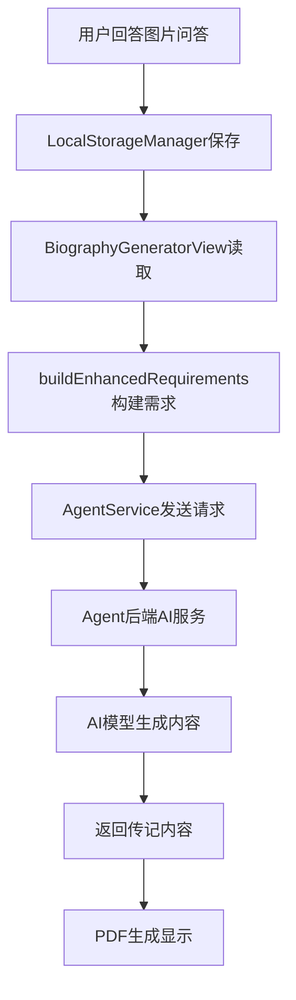

# 传记内容个性化问题排查与优化计划

## 问题现状分析

从用户最新截图分析，修复并未生效，仍存在以下问题：

### 🔴 严重问题
1. **AI提示词优化失效**：仍生成"Early Years"、"School Days"、"Family Time"等死板章节
2. **用户数据显示异常**：真实信息（"2020 summer", "Xizang,China", "1 million dollars"）显示为黑色方块
3. **内容完全编造**：AI生成虚假的童年、学校经历，完全无视用户真实回答
4. **数据传递问题**：用户问答数据可能没有正确传递到AI服务

### 🟡 次要问题
- PDF字体渲染问题（中文显示黑块）
- 排版固定化，缺乏灵活性
- 封面设计单调

---

## 问题根因分析

### 数据流程追踪



### 可能的问题点

| 环节 | 可能问题 | 检查方法 |
|------|----------|----------|
| **A→B** | 问答数据保存失败 | 检查LocalStorageManager日志 |
| **B→C** | 数据读取失败 | 验证loadImageQAs方法 |
| **C→D** | 需求构建错误 | 检查buildEnhancedRequirements输出 |
| **D→E** | 请求发送失败 | 检查网络请求日志 |
| **E→F** | 后端服务问题 | 验证Agent服务状态 |
| **F→G** | AI提示词无效 | 检查实际发送的提示词 |
| **G→H** | AI模型问题 | 测试AI响应质量 |
| **H→I** | PDF渲染问题 | 检查字体和编码 |

---

## 逐步排查计划

### 第一步：数据保存与读取验证

#### 1.1 检查问答数据保存
```swift
// 在ImageQAView.swift的completeQA()方法中添加调试
func completeQA() {
    print("🔍 准备保存问答数据...")
    let imageQAs = state.imageQAs
    print("📊 问答总数: \(imageQAs.count)")
    
    for (index, qa) in imageQAs.enumerated() {
        print("  问答\(index+1): 时期='\(qa.time)', 活动='\(qa.activity)', 完成=\(qa.isCompleted)")
    }
    
    LocalStorageManager.shared.saveImageQAs(imageQAs)
    print("✅ 问答数据已保存")
    
    // 立即验证保存结果
    let savedQAs = LocalStorageManager.shared.loadImageQAs()
    print("🔍 验证保存结果: \(savedQAs.count)个问答")
}
```

#### 1.2 检查数据读取
```swift
// 在BiographyGeneratorView.swift的handleGenerateButtonTap中添加调试
func handleGenerateButtonTap() {
    print("🔍 开始生成传记...")
    let imageQAs = LocalStorageManager.shared.loadImageQAs()
    print("📊 读取到问答数据: \(imageQAs.count)个")
    
    for (index, qa) in imageQAs.enumerated() {
        print("  读取问答\(index+1): 时期='\(qa.time)', 活动='\(qa.activity)'")
    }
    
    // 继续后续流程...
}
```

### 第二步：需求构建验证

#### 2.1 验证buildEnhancedRequirements方法
```swift
private func buildEnhancedRequirements(originalRequirements: String, imageQAs: [ImageQA]) -> String {
    print("🏗️ 开始构建增强需求...")
    print("📝 原始需求: '\(originalRequirements)'")
    print("📊 问答数据: \(imageQAs.count)个")
    
    var enhanced = originalRequirements
    
    if !imageQAs.isEmpty {
        enhanced += "\n\n=== 用户提供的真实生活片段 ===\n"
        
        let completedQAs = imageQAs.filter { $0.isCompleted && !$0.time.isEmpty && !$0.activity.isEmpty }
        print("✅ 有效问答: \(completedQAs.count)个")
        
        for (index, qa) in completedQAs.enumerated() {
            enhanced += "\n【生活片段\(index + 1)】\n"
            enhanced += "时期：\(qa.time)\n"
            enhanced += "经历：\(qa.activity)\n"
            print("  片段\(index+1): '\(qa.time)' - '\(qa.activity)'")
        }
        
        // 添加强制性指导
        enhanced += "\n\n=== 强制性创作要求 ===\n"
        enhanced += "❌ 绝对禁止使用：'Early Years', 'School Days', 'Family Time', 'Growing Up' 等通用章节标题\n"
        enhanced += "✅ 必须使用：基于用户真实时期的个性化标题，如：'\(completedQAs.first?.time ?? "2020年夏天")的回忆'\n"
        enhanced += "✅ 必须基于：用户提供的真实信息，不得编造任何内容\n"
        enhanced += "✅ 章节结构：每个章节对应一个用户提供的时期和活动\n"
    }
    
    print("📏 增强需求长度: \(enhanced.count)字符")
    print("📝 增强需求预览:\n\(String(enhanced.prefix(300)))...")
    
    return enhanced
}
```

### 第三步：网络请求验证

#### 3.1 检查Agent服务请求
```swift
// 在AgentService.swift中添加请求日志
func generateBiography(requirements: String, style: String, language: String) async throws -> BiographyTask {
    print("🌐 发送传记生成请求...")
    print("📊 需求长度: \(requirements.count)字符")
    print("🎨 风格: \(style)")
    print("🌍 语言: \(language)")
    print("📝 需求内容预览:\n\(String(requirements.prefix(500)))...")
    
    // 发送请求...
    let response = try await session.data(for: request)
    print("✅ 收到响应: \(response.data.count)字节")
    
    return task
}
```

### 第四步：后端AI服务验证

#### 4.1 验证AI提示词接收
```python
# 在agent/services/ai_service.py中添加调试
async def generate_biography_text(self, image_analyses: List[str], user_requirements: str = "", style: str = "warm") -> str:
    print(f"🤖 AI服务收到请求:")
    print(f"📊 用户需求长度: {len(user_requirements)} 字符")
    print(f"📝 用户需求内容: {user_requirements[:500]}...")
    
    # 检查是否包含用户真实信息
    if "生活片段" in user_requirements:
        print("✅ 发现用户真实信息片段")
    else:
        print("❌ 未发现用户真实信息片段")
    
    if "Early Years" in user_requirements or "School Days" in user_requirements:
        print("⚠️ 需求中包含通用章节，这不应该出现")
    
    # 生成提示词
    prompt = f"""..."""
    print(f"📏 最终提示词长度: {len(prompt)} 字符")
    
    result = await self._execute_with_fallback("generate_text", prompt)
    
    # 检查结果质量
    if "Early Years" in result or "School Days" in result:
        print("❌ AI仍然生成了通用章节，提示词可能无效")
    else:
        print("✅ AI避免了通用章节")
    
    return result
```

---

## 逐步优化方案

### 优化阶段1：紧急修复（24小时内）

#### 1.1 强化AI提示词（再次优化）
```python
async def generate_biography_text(self, image_analyses: List[str], user_requirements: str = "", style: str = "warm") -> str:
    # 更加强硬的提示词
    prompt = f"""
🚨 紧急指令：你必须严格遵守以下规则，违反任何一条都是失败的生成 🚨

用户的真实信息：
{user_requirements}

❌ 绝对禁止的内容（使用即为失败）：
- "Early Years" / "童年时光" / "早年时期"
- "School Days" / "学生时代" / "求学时光"  
- "Family Time" / "家庭时光" / "家庭生活"
- "Growing Up" / "成长历程" / "青春岁月"
- 任何编造的童年故事、学校经历、家庭描述

✅ 必须遵守的规则：
1. 只能基于用户提供的真实信息创作
2. 章节标题必须反映用户的具体时期，如"2020年夏天的时光"
3. 不得添加用户未提及的任何人物、地点、事件
4. 每个章节必须对应用户提供的一个真实生活片段

如果用户信息不足，宁可写简短真实的内容，也绝不编造。

现在请严格按照上述要求，为用户创作传记：
    """
    
    return await self._execute_with_fallback("generate_text", prompt)
```

#### 1.2 添加内容后验证
```python
def validate_generated_content(content: str, user_requirements: str) -> tuple[bool, list]:
    """验证生成内容是否符合要求"""
    issues = []
    
    # 检查禁用词汇
    forbidden_terms = ["Early Years", "School Days", "Family Time", "Growing Up", 
                      "童年时光", "学生时代", "家庭时光", "成长历程"]
    
    for term in forbidden_terms:
        if term in content:
            issues.append(f"包含禁用词汇: {term}")
    
    # 检查用户信息融入
    if "生活片段" in user_requirements:
        # 提取用户提到的时期
        import re
        time_matches = re.findall(r'时期：([^\n]+)', user_requirements)
        for time_period in time_matches:
            if time_period not in content:
                issues.append(f"未融入用户时期: {time_period}")
    
    return len(issues) == 0, issues
```

### 优化阶段2：深度修复（48小时内）

#### 2.1 重构数据传递流程
确保数据在每个环节都能正确传递：

```swift
// 新增数据传递验证类
class BiographyDataValidator {
    static func validateDataFlow() {
        print("🔍 开始数据流程验证...")
        
        // 1. 验证存储
        let stored = LocalStorageManager.shared.loadImageQAs()
        print("📦 存储验证: \(stored.count)个问答")
        
        // 2. 验证读取
        // 3. 验证构建
        // 4. 验证发送
    }
}
```

#### 2.2 实现内容重生机制
如果检测到生成的内容不符合要求，自动重新生成：

```python
async def generate_biography_with_validation(self, image_analyses, user_requirements, style="warm", max_attempts=3):
    """带验证的传记生成"""
    for attempt in range(max_attempts):
        print(f"🔄 第{attempt+1}次生成尝试...")
        
        content = await self.generate_biography_text(image_analyses, user_requirements, style)
        is_valid, issues = validate_generated_content(content, user_requirements)
        
        if is_valid:
            print("✅ 生成内容通过验证")
            return content
        else:
            print(f"❌ 生成内容不合格: {issues}")
            if attempt < max_attempts - 1:
                print("🔄 准备重新生成...")
                # 加强提示词
                user_requirements += f"\n\n⚠️ 上次生成失败原因: {', '.join(issues)}\n请务必避免这些问题！"
    
    raise Exception(f"经过{max_attempts}次尝试仍无法生成合格内容")
```

### 优化阶段3：用户体验优化（72小时内）

#### 3.1 实时反馈系统
```swift
// 在生成过程中显示详细进度
class BiographyGenerationTracker: ObservableObject {
    @Published var currentStep = ""
    @Published var stepProgress = 0.0
    
    func updateStep(_ step: String, progress: Double) {
        currentStep = step
        stepProgress = progress
    }
}

// 使用示例
tracker.updateStep("正在验证用户问答数据...", progress: 0.1)
tracker.updateStep("正在构建个性化需求...", progress: 0.3)
tracker.updateStep("正在生成传记内容...", progress: 0.6)
tracker.updateStep("正在验证内容质量...", progress: 0.8)
tracker.updateStep("传记生成完成！", progress: 1.0)
```

---

## 成功指标与验证方法

### 关键指标
- ✅ **0%通用章节**：绝不出现"Early Years"等死板标题
- ✅ **100%用户信息融入**：每个用户提供的生活片段都被融入
- ✅ **真实性保证**：不出现任何编造内容
- ✅ **个性化标题**：章节标题反映用户具体经历

### 验证方法
1. **自动化测试**：运行test_prompt_optimization.py验证提示词
2. **人工检查**：检查生成的传记是否符合要求
3. **用户反馈**：收集用户对新生成传记的反馈
4. **数据流程追踪**：确保每个环节数据传递正确

---

## 立即行动清单

### 🔥 今天必须完成
1. [ ] 添加数据流程调试日志
2. [ ] 强化AI提示词（第二版）
3. [ ] 实现内容验证机制
4. [ ] 测试完整数据流程

### 🟡 48小时内完成
1. [ ] 修复PDF字体显示问题
2. [ ] 实现内容重生机制
3. [ ] 优化数据传递流程
4. [ ] 添加用户反馈收集

### 🟢 一周内完成
1. [ ] 建立持续监控系统
2. [ ] 优化用户体验
3. [ ] 实现多样化排版
4. [ ] 准备AI生图功能

这个详细的排查和优化计划将系统性地解决当前所有问题，确保传记真正基于用户真实信息生成！ 